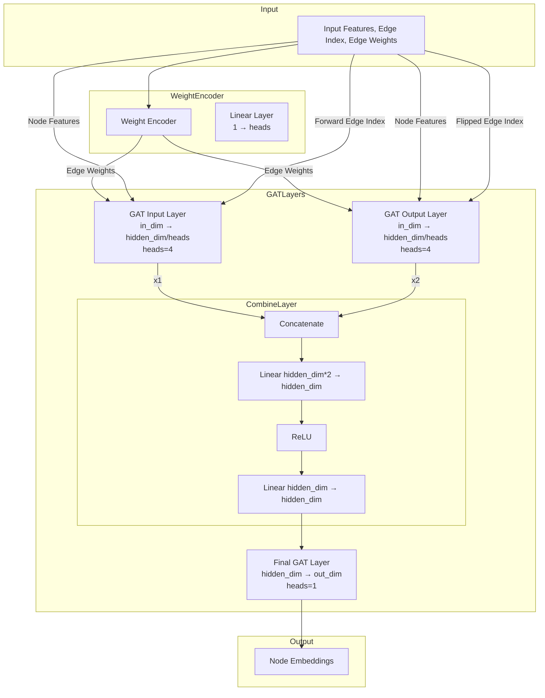
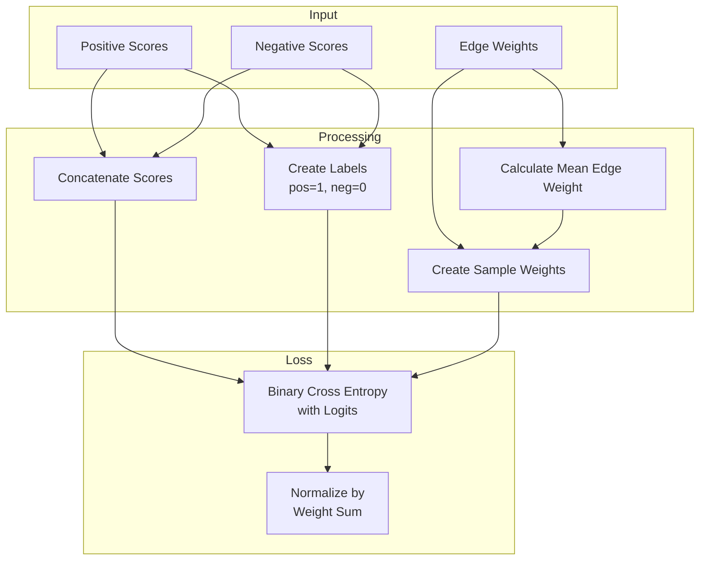

# Model Architecture

## WeightedGAT Architecture

## WeightedBCELoss Computation Flow

## Key Features

1. **WeightedGAT:**
   - Multi-head attention (4 heads by default)
   - Bidirectional information flow
   - Edge weight encoding
   - Dropout regularization
   - Two-stage GAT processing with MLP combination

2. **WeightedBCELoss:**
   - Weighted loss computation
   - Separate handling of positive and negative samples
   - Edge weight-based sample importance

3. **Training Features:**
   - Adam optimizer
   - ReduceLROnPlateau scheduler
   - Average Precision (AP) metric tracking
   - Negative edge sampling